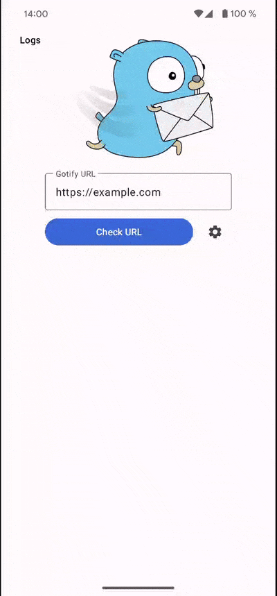

# Gotify Android [![Build Status][github-action-badge]][github-action] [![FOSSA Status][fossa-badge]][fossa] [![latest release version][release-badge]][release] [![F-Droid][fdroid-badge]][fdroid]



Gotify Android connects to [gotify/server](https://github.com/gotify/server) and shows push notifications on new messages.

## Features

* show push notifications on new messages
* view and delete messages

## Installation

Download the apk or get the app via F-Droid or Google Play.

[][playstore]
[][fdroid]
[][release]

Google Play and the Google Play logo are trademarks of Google LLC.

### Disable battery optimization

By default Android kills long running apps as they drain the battery. With enabled battery optimization, Gotify will be killed and you wont receive any notifications.

Here is one way to disable battery optimization for Gotify.

* Open "Settings"
* Search for "Battery Optimization"
* Find "Gotify" and disable battery optimization

### Minimize the Gotify foreground notification

*Only possible for Android version >= 8*

The foreground notification with content like `Listening to https://push.yourdomain.eu` can be manually minimized to be less intrusive:

* Open Settings -> Apps -> Gotify
* Click Notifications
* Click on `Gotify foreground notification`
* Select a different "Behavior" or "Importance" (depends on your android version)
* Restart Gotify

## Message Priorities

| Notification | Gotify Priority|
|- |-|
| - | 0 |
| Icon in notification bar | 1 - 3 |
| Icon in notification bar + Sound | 4 - 7 |
| Icon in notification bar + Sound + Vibration | 8 - 10 |

## Building

Execute the following command to build the apk.
```bash
$ ./gradlew build
```

## Update client

* Run `./gradlew generateSwaggerCode`
* Discard changes to `client/build.gradle` (newer versions of dependencies)
* Fix compile error in `client/src/main/java/com/github/gotify/client/auth/OAuthOkHttpClient.java` (caused by an updated dependency)
* Delete `client/settings.gradle` (client is a gradle sub project and must not have a settings.gradle)
* Commit changes

## Versioning
We use [SemVer](http://semver.org/) for versioning. For the versions available, see the
[tags on this repository](https://github.com/gotify/android/tags).

## License
This project is licensed under the MIT License - see the [LICENSE](LICENSE) file for details

 [github-action-badge]: https://github.com/gotify/android/workflows/Build/badge.svg
 [github-action]: https://github.com/gotify/android/actions?query=workflow%3ABuild
 [playstore]: https://play.google.com/store/apps/details?id=com.github.gotify
 [fdroid-badge]: https://img.shields.io/f-droid/v/com.github.gotify.svg
 [fdroid]: https://f-droid.org/de/packages/com.github.gotify/
 [fossa-badge]: https://app.fossa.io/api/projects/git%2Bgithub.com%2Fgotify%2Fandroid.svg?type=shield
 [fossa]: https://app.fossa.io/projects/git%2Bgithub.com%2Fgotify%2Fandroid
 [release-badge]: https://img.shields.io/github/release/gotify/android.svg
 [release]: https://github.com/gotify/android/releases/latest
 
